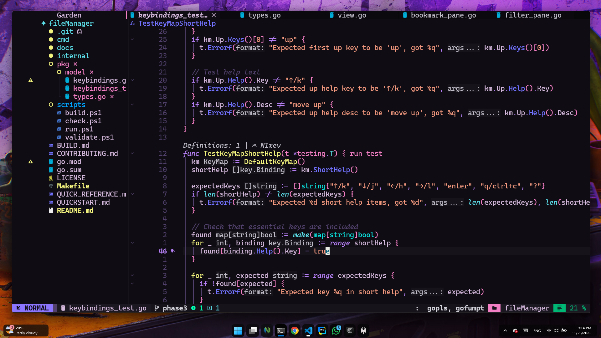

# SamoulyVim, **\# VIM.**

<div align="center">


[](https://github.com/neovim/neovim)


</div>

## Installation

### Prerequisites

- Neovim >= 0.9.5
- Tmux >= 3.2 (optional, for tmux integration)

### Quick install

Please follow these steps:

1. **Preparation**:
   - Ensure that Neovim is not running.
   - Remove or move your current `nvim` directory (if it exists).

2. **Installation**:
   - On Linux/MacOS:

```sh
 bash <(curl -s https://raw.githubusercontent.com/N1xev/SamoulyVim/main/install.sh)
```

- On Windows (Powershell):

```ps1
 Invoke-WebRequest https://raw.githubusercontent.com/N1xev/SamoulyVim/main/install.ps1 -UseBasicParsing | Invoke-Expression
```

The installer will:

- Detect your package manager (Linux: paru/yay, Windows: winget/choco)
- Force install essential tools: opencode, ripgrep, fd
- Let you select which languages to install: Go, Rust, Node.js, Python

### Manual Installation

If you prefer manual setup:

#### Package Managers

**Arch Linux with yay:**

```sh
yay -S opencode ripgrep fd go rust nodejs python
```

**Arch Linux with paru:**

```sh
paru -S opencode ripgrep fd go rust nodejs python
```

**Windows with winget:**

```powershell
winget install opencode ripgrep fd Go.Go Rustlang.Rust OpenJS.NodeJS Python.Python.3
```

**Windows with Chocolatey:**

```powershell
choco install opencode ripgrep fd go rust nodejs python
```

#### Neovim Setup

1. Clone this repository:

```bash
git clone https://github.com/N1xev/SamoulyVim ~/.config/nvim
```

2. Start Neovim:

```bash
nvim
```

3. Lazy will automatically install all plugins and dependencies.

## Themes

SamoulyVim includes multiple custom themes:

- Azure Depth
- Desert Sunset
- Forest Whisper
- Lavenadr Dreams
- Nahody
- Samtone
- Tailsvim
- Volcanic Ash

Themes automatically sync with tmux colors. Switch themes with `:Telescope colorscheme` or `:colorscheme <theme>`.

## Supported Languages

- **Go**: LSP, debugging, testing, formatting
- **Rust**: LSP, debugging, cargo integration
- **TypeScript/JavaScript**: LSP, formatting
- **Python**: LSP, linting (install python-lsp-server)

## Documentation

Refer to [LazyVim documentation](https://lazyvim.github.io/installation) for general usage.

### Key Bindings

- `<leader>e`: Toggle nvim-tree
- `<leader>o`: OpenCode commands
- `<leader>f`: Telescope find files
- `<leader>g`: Telescope live grep

## 🤝 Contributing

Contributions welcome! Please open issues or pull requests.

## 📄 License

Apache v2 License - see LICENSE file for details.
